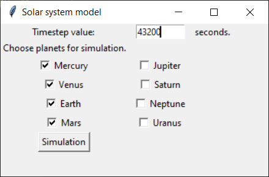
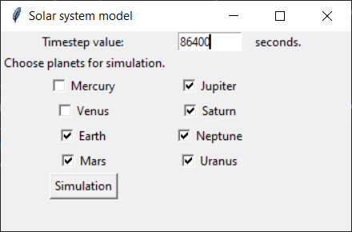

# Solar system model
> 2D Solar System model.

## General info
Gravitational model of the Solar System. It uses Euler method to estimate position and velocity of objects.
User can add additional objects. GUI created using Tkinter and animation created using Matplotlib.

## Technologies
* Python 3.8.0
    * NumPy
	* Matplotlib
    * Tkinter

## How to install
1. Download the .zip or clone the repository. 
2. Run pip install -r requirements.txt.
3. Run main.py.
	
## Screenshots

Inner planets simulation with additional extrasolar object.

Solar System simulation - Mercury and Venus excluded. 

## Modules
* models.py - contains SpaceObject class and its childs.
* simulation.py - contains SolarSystemSimulation class.
* tests - module that contains all tests.
* gui.py - module that contains GUI.

## Status
Project is: _in progress_